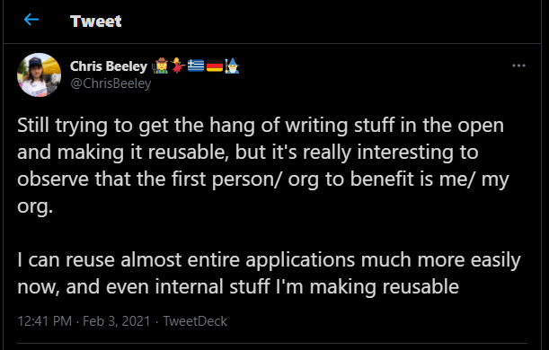

# What is working out in the open?

```{r setup, include=FALSE}
knitr::opts_chunk$set(echo = TRUE, eval = FALSE)

library(dplyr)
library(kableExtra)
```

"Working in the open" isn't a technical term; it's just my simple way of explaining a concept without having to mention all the tools that are available to do this. 

```{r pic, fig.alt="Tweet from Chris Beeley on working writing stuff in the open", echo=FALSE, eval=TRUE}



```

As you can see from @ChrisBeeley's tweet, he refers to "writing stuff in the open and making it reusable"; we use slightly different language but it covers the same principles.

#### Being open in the Public Sector

I've always found that analysts working in the NHS and Local Authorities are always happy to share their methodologies, approaches to work and even code and how we shared this was often dictated by who we know and the tools we have to hand, like Excel or Word. If a change was made to the original I'd never know about it and, vice versa, if I improved the code I wouldn't have an easy way to share back what I'd done. 

Whilst analysts were happy to share code I still built up a code repository for myself and for many years I recycled my own code. I often refer back to projects where I know I've written a particular bit of code that is useful and I'd rarely wrote out complete chunks of code that ran independently of project data. Working openly changes how you approach code because sharing projects that don't work too well without some changes isn't all that useful to others. 

Working with an intention to be open makes you aware of public scrutiny and so, inevitably, you may take a bit longer to make code tidy, write a few more explanatory comments and ensure that code does what you think it should. What's nice about doing this is that although the openness of work is intended for someone else's benefit, often that person is still you. 

#### Repeatedly solving the same problem

Many of the tasks that analysts and data scientists in the public sector are tasked with are the same. National Returns and benchmarking submissions are common and are completed by many trusts using slightly different approaches but, ultimately, leading to the same data output. This results in a constant cycle of problem solving where the solution, if not shared publicly, means others have to do the very same discovery work.

In a completely different context, it would be like finding a chemical compound, not sharing that knowledge and other people working hard in other labs to repeat the discovery. By constantly working in this 'discovery' phase we never further our collective knowledge by refining the techniques, analysing the results and, hopefully, using the "compound" to make a difference.

Publishing code means that anyone in my team, my trust, the NHS, even the world can see what I have already discovered. In sharing to the world audience, I know I have something I myself can use. Of course, it takes time to write these things out but once it's written it never needs to be rediscovered again - but it can be improved upon.

#### How do the CDU data science work in the open?

The CDU data science team have a strong desire to work openly and we have created a [GitHub](https://github.com/CDU-data-science-team) account to share code and knowledge like the pages on [IMD](https://github.com/CDU-data-science-team/Miscellany/blob/master/Indices-of-Multiple-Deprivation.md)^[Indices of Multiple Deprivation] and [mapping](https://github.com/CDU-data-science-team/Miscellany/blob/master/Mapping.md). 

We are also involved with the [NHS-R Community](https://nhsrcommunity.com/), facilitating training, presenting webinars and talks as well as hosting the annual [Hacktoberfest](https://hacktoberfest.digitalocean.com/) which was virtual last year. We had originally set up the Hacktoberfest to just be our team, setting aside one day to contribute to projects and practice using GitHub. Pretty quickly after agreeing this would be a good idea we extended this to the NHS-R Community as we felt that there really wasn't any need for it to be restricted to just our team. We had a few people come in and out of the MS Teams meeting through the day and, like many things in the NHS-R Community, it was very supportive and informal. 

#### Buiding up skills

Working on other people's projects in a Hackathon may seem, on the face of it, "non-essential" work, but it's invaluable as it not only opens up connections with others who can help with your projects, but you invariably see useful code you can then use. Reviewing code is one thing, but to really understand a piece of code, debug or solve a problem you often have to break it apart and build it back up. In doing so you learn how it is constructed programmatically and how the other person/people have approached a problem. Doing this with others' scripts has made me a better coder and none of the effort has been wasted. 

A recent example of valuable "non-essential" work for me was helping someone in the NHS-R Community Slack group who had an issue with their RMarkdown and getting a plotly chart to appear in the eventual html output, although it would appear when each chunk was run. I took the code and moved each chunk into a template RMarkdown to see if it ran, section by section. In doing so I located the problem but I also saw a new bit of code^[The problem was results='hide' being in the knitr::opts_chunk$set() code which affects the output. I'm still learning how these codes work so didn't spot that at first, so I learned more about RMarkdown by debugging.] 

```{r, eval=FALSE, echo=TRUE}
code_folding: "hide"
```


which I'd never seen that before. Now I could have equally have learned about this from reading about RMarkdown but it will forever stick in my memory as it was in the context of solving a problem. We helped each other and now I'm sharing that learning in this blog - working out in the open. 

```{r, eval=FALSE, echo=TRUE}
# The full YAML for reference

---
title: "Test"
date: "25/02/2021"
output: 
  html_document:
    code_folding: "hide"
    toc: true
    toc_float: true
    toc_collapsed: false
---
```


If you want to read more about how our journey is going with working out in the open keep in touch by following us on [Twitter](https://twitter.com/DataScienceNott) and in these [blogs](https://cdu-data-science-team.github.io/team-blog/).