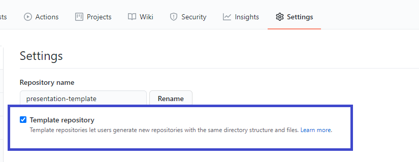
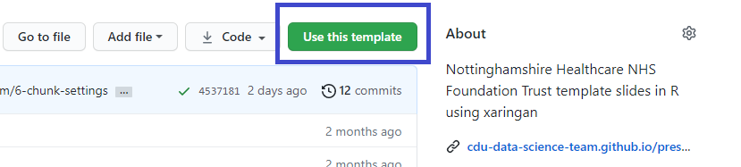
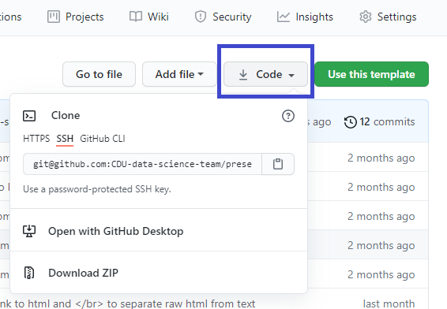

```{r setup, include=FALSE}
knitr::opts_chunk$set(echo = FALSE)
```

# Creating a template GitHub repository

After creating {xaringan} presentations slides for the CDU Data Science Team using the branding from Nottinghamshire Healthcare NHS Foundation Trust, I wanted to share the files used as a template. There are quite a few used in {xaringan} slides because it relies upon CSS and images to give the 'professional' look similar to PowerPoint. 

One of the new features in GitHub is to make your repository a template:



And the nice thing about this, is when someone selects the template button:



It means they can fork the repository (get a copy) but all of the commit history is removed giving the next person - if they want - a clean repository to work from. People still have the option to clone the repository with the history by following the usual cloning:



