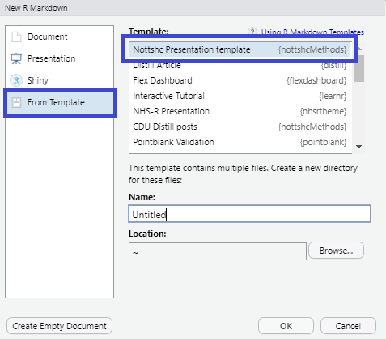

```{r setup, include=FALSE}
knitr::opts_chunk$set(echo = FALSE)
```

# Creating a template through R Studio

Did you know it's possible to set up your own templates into RStudio? I didn't until I started looking into the presentation templates for the CDU Data Science Team. The benefit of this is that I no longer have to set up clone repositories each time which is awkward too if you want to keep all presentations in one repository like we do for the [team's presentations](https://github.com/CDU-data-science-team/presentations).
 
A few in the team suggested setting these up as a package but {xaringan} slides come with many supporting files (images and CSS), and it wasn't too obvious how to do this. Luckily a number of people have done it and one such person tweeted about it so I added the details to the repository's [issues](https://github.com/CDU-data-science-team/presentation-template/issues/7) for reference.

This led me to @DrMowinckels's package [{uiothemes}](https://github.com/Athanasiamo/uiothemes/) which is particularly useful as she uses this package for various templates and themes and so, following the layout for adding the xaringan slides I added the following folders to our own package [{nottshcMethods}](https://github.com/CDU-data-science-team/nottshcMethods) following our process of:

(@) create a branch with the issue number like 1-slide-templates
(@) make the changes
(@) set up a pull request to the development branch

#### File structure

I added the file structure:

nottshcMethods/inst/rmarkdown/templates/Nottshc/skeleton

and in the Nottshc folder I added a file called <kbd>template.yaml</kbd> containing:

```
name: Nottshc Presentation template
description: >
   Standard xaringan Nottshc template for presentations
create_dir: TRUE
```

The <kbd>create_dir</kbd> is particularly important as this is asking if a new folder directory should be created or not. As this is set to TRUE all the files and folder structure in the folder skeleton will be copied. Note that in {uiothemes} all xaringan files are within one folder but I prefer my files to be in subfolders so {nottshcMethods} has the subfolders css and img.

<kdb>name</kbd> is what will appear in the RStudio templates later so this needs to be clear and concise.

In the folder <kbd>skeleton</kbd> the important file is the <kbd>skeleton.Rmd</kbd> which is the template RMarkdown file for the slides. 

As this is within a package, to run the package <kbd>Ctrl+Shift+B</kbd> will build the package on your computer. When that's run the template will appear in <kbd>File/New File/R Markdown.../From Template</kbd>
  
  

## Addendum and a plea to blog things like this

I wrote this out a number of weeks before publishing and I'm so glad I did as I immediately forgot everything I did. It was only when I needed to do a presentation and went to my templates in RStudio that I realised how great this is and how I couldn't remember how I had set it all up. Luckily I had also started this blog in order to share with others and so the moral of the story is, when you write a blog you are sharing your current knowledge with others, but also your future self. 

Be kind to your future self, share your thoughts and your technical wins, even if they seem small to you today they may be huge tomorrow.

