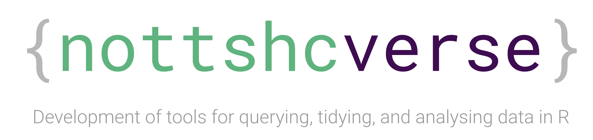
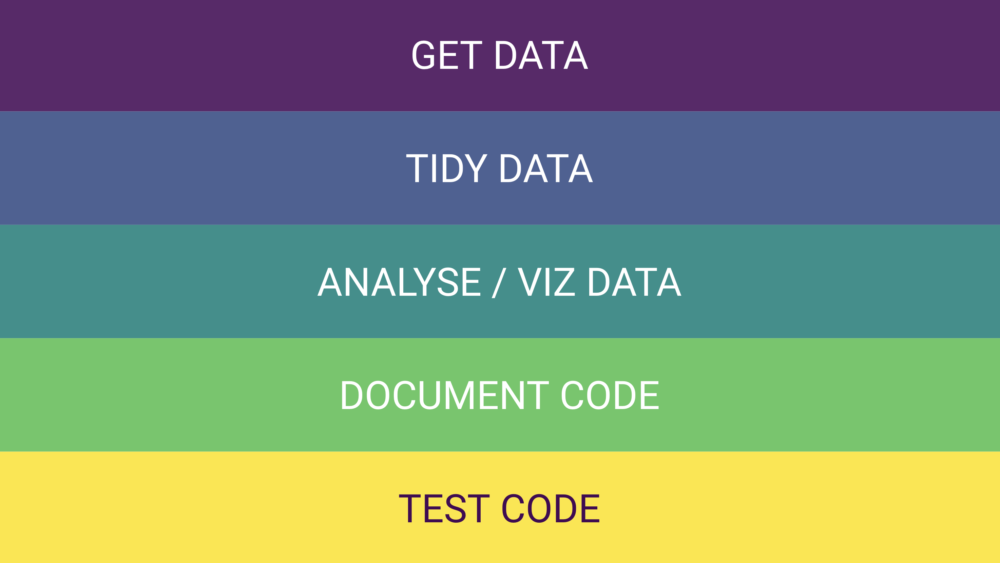
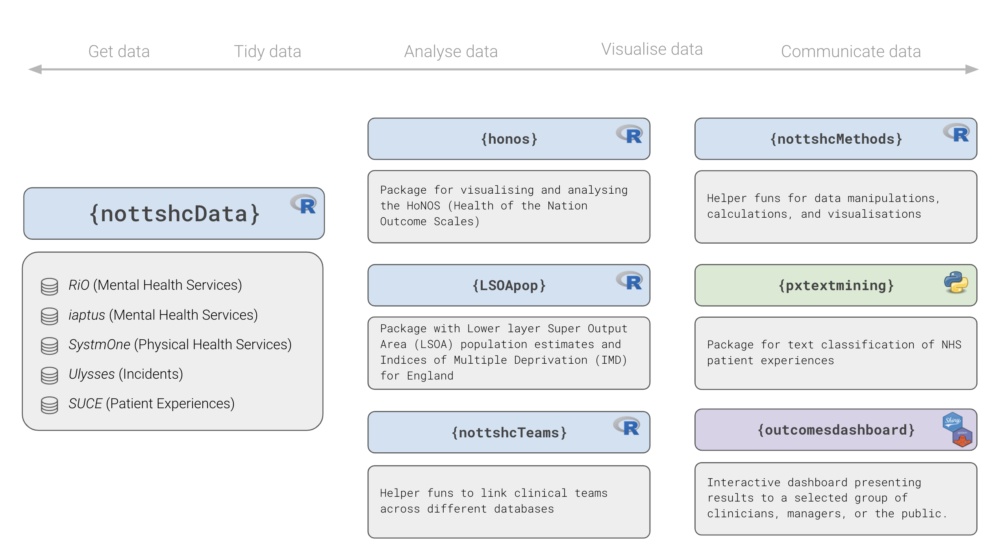

```{r setup, include=FALSE}
knitr::opts_chunk$set(echo = TRUE)
```

```{r, echo=FALSE, fig.alt="Image of the words nottshcverse with curly brackets around it"}

```

Our team works with routinely collected NHS patient data.
Currently we focus on understanding better how patients are using the service, changes in clinical outcome measures, and analysis of patient experiences.
The main questions that guide our work are *'What works for whom and how does it work?'*, *'What doesn't work?'*, and *'How can we integrate patient experiences into our analyses?'*. 
We developed a set of different tools, the **`{nottshcverse}`**, to help us look at these questions by automating recurring and time-consuming tasks so that we can spend more time thinking the clinical questions.

## Challenges and solutions

Real data is messy but we should do our best to tidy the mess, where possible in an automated way.
There are many challenges when working with healthcare data, here is only a small selection of those that I think underlies most analyses.
Figure \@ref(fig:fig-nottshcverse-overview-funs) shows our solutions to these challenges.

```{r fig-nottshcverse-overview-funs, echo=FALSE, fig.cap="Main goals that guided the development of the {nottshcverse} packages."}

```

1. `r emo::ji("thinking")` It's really hard to get the clinical data that is needed in a reproducible way that is consistent across different people who work on the same (or related) analysis. This is particularly true because most of the data is stored on SQL servers and only starts to make sense after joining multiple different datasets. `r emo::ji("nerd")` **We wrote functions that made it very easy and secure to *(i)* connect to and *(ii)* query data from different databases that we are working with. This way we could get the data we needed for our analyses using very few lines of code in R.**

```{r, eval=FALSE}
# First, create connection to databases
conn_s1 <- connect_sql(server = "SystmOne")
conn_iapt <- connect_sql(server = "IAPTus")

# Now we can use the connection to get contacts data from SystmOne ...
db_contacts_s1 <- get_s1_contacts(from = "2020-01-01", 
                                  to = "2020-12-31", 
                                  conn = conn_s1)

# ... and IAPTus databases
db_contacts_iapt <- get_iapt_contacts(from = "2020-01-01", 
                                      to = "2020-12-31", 
                                      conn = conn_iapt)

# Note that the objects 'contacts_s1' and 'contacts_iapt' are just pointing to 
# the databases (I like to use the prefix db) and not actually downloaded to the
# environment on your computer.
```

2. `r emo::ji("thinking")` Most of the time, the data is not in the format that is needed for further analyses. There may be specific data manipulations that are needed to make sense of the data and analyse it properly. Also, different databases might be set up in ways that it is hard to merge data. `r emo::ji("nerd")` **We wrote function that tidy the raw data from the databases so that it is more consistent across databases and easier to analyse. All of this still happens within the server so that our computers don't have to do all of this work.**

```{r, eval=FALSE}
# Each get_*_data() function comes with a tidy_*_data(), here tidy_s1_contacts()
# Here I use the connection to the raw (messy) contacts  data that I created above
# and tidy it using the tidy_s1_contacts() function
db_contacts_s1 <- db_contacts_s1 %>% 
  tidy_s1_contacts()

db_contacts_iapt <- db_contacts_iapt %>% 
  tidy_iapt_contacts()
```

3. `r emo::ji("thinking")` The methods of data analyses and visualisations should be understandable, reproducible, and available to other people. Unfortunately this is not always the case yet because the software tools that are used (e.g., Excel, PowerBI, and other silly solutions that are not worth their money) are not script based and usually shared in private emails. `r emo::ji("nerd")` **We wrote R functions for common analytical tasks and visualisations.**

4. `r emo::ji("thinking")` Code should be really well documented so that it is easy to understand what's going on. This includes the current version of the code as well as all previous versions and changes. This can be done using tools like Git and GitHub, but unfortunately most code is currently shared undocumented in private emails. `r emo::ji("nerd")` **We created detailed documentations that are easily accessible to everyone who uses our R packages. Also, because develop our tools on GitHub, every change to our code is documented.**

5. `r emo::ji("thinking")` Mistakes happen! Sometimes things that you have no control over can change and break your code that previously worked fine (e.g., the format of the raw data or a functions that someone else wrote). Therefore, it's important to continuously test whether the code is still working the way it's supposed to work. `r emo::ji("nerd")` **R packages (or similar solutions in other statistical programming languages) are relatively easy to test, for example using the [{testthat}](https://testthat.r-lib.org/) package. We started to implement tests into our work so that we can check if changes that we make to our code don't break anything.**

## Overview of the {nottshcverse}

```{r fig-nottshcverse-overview-pkgs, echo=FALSE, fig.cap=paste0("Overview of some R packages developed by the Clinical Development Unit Data Science Team", emo::ji("star"), "and the NHS-R Community ", emo::ji("red_heart"))}

```

- `{nottshcData}`:  Unified framework to query, transform, and aggregate data from different databases
- `{nottshcMethods}`: Tools for performing common analytical tasks (e.g., grouping continuous age into groups)
- `{honos}`, `{LSOApop}`: Packages designed in generic way to help use and others `{nottshcData}` work with specific questionnaires (e.g., Health of the Nation Outcome Scales, HoNOS) or open data sets (e.g. LSOA population estimates)
- `{outcomesdashboard}`: Our dashboards use all the packages mentioned above + special packages developed specifically to support the dashboards with helper functions

## Simplified working example

To illustrate how R can be used to work with databases I'll use the following example.
Imagine we're working with a database called `SystmTwo` `(S2)` and need to use two different tables for our analysis:

- `[S2].[contacts]`: Information about contacts with clinical teams
- `[S2].[demographics]`: Some demographic information

```{r echo=FALSE}
# Load packages
library(DBI)
library(tidyverse)
library(RSQLite)
```

### Create example data

```{r}
# Set up example contacts table
contacts_s2 <- tibble(client_id = c(1, 1, 1, 2), 
                      contact_id = c(123, 124, 125, 156), 
                      referral_id = c(456, 459, 500, 501), 
                      referral_date = c("2018-04-19", "2019-05-23", 
                                        "2020-06-01", "2018-12-11"),
                      contact_date = c("2018-05-19", "2019-06-05", 
                                       "2020-07-08", "2019-01-15"),
                      team_id = c("tm1", "tm2", "tm1", "tm1"), 
                      hcp_id = c("hcp1", "hcp2", "hcp1", "hcp1"), 
                      contact_type = c("phone", "f2f", "video", "phone"),
                      assessment_id = c(321, 322, 344, NA))

# Set up example demographics table with 2 patients
demographics_s2 <- tibble(client_id = c(1, 2), 
                          dob = c("1988-01-01", "1965-01-01"),
                          dod = c(NA, NA),
                          sex = c("f", "m"))
```

### Create `SQLite` connection

```{r}
# Create connection (conn) to "local" database called SystmTwo (s2)
conn_s2 <- DBI::dbConnect(RSQLite::SQLite(), ":memory:")

# Copy local data frame to conn_s2 database
db_s2_contacts <- copy_to(conn_s2, contacts_s2)
db_s2_demographics <- copy_to(conn_s2, demographics_s2)
```

### Example analysis

Here we join the contacts with the demographics information to calculate the age at the time a patient has their contact (`age_at_contact`).

```{r }
# Calculate age at time of contact
db_age_at_contacts <- db_s2_contacts %>% 
  left_join(db_s2_demographics) %>% 
  mutate(age_at_contact = as.Date(contact_date) - as.Date(dob))
```

### Writing a function

We can also write our own functions and use them in a modular way whenever we need them.
Here's a simple example to demonstrate how we can do the same calculation as shown above using our own function.
In this example the function arguments take the variable names for date of birth (`dob`) and the contact date (`contact_date`).

```{r}

calc_age_at_contact <- function(data, var_dob, var_contact_date) {
  # Add code here to check that arguments are specified correctly
  data %>% 
    dplyr::mutate(age_at_contact = as.Date({{var_contact_date}}) - as.Date({{var_dob}}))
  }
```

### Example `SQL` code

As mentioned above (Challenges and solutions, Point 1), the object that we work with most of the time are just SQL queries and not real data stored in your R environment.
We can look at the underlying SQL code using the `dplyr::show_query()` function.
I don't really know SQL very well myself, but some people who do have created a great package that translates R code into SQL code (see the [dbplyr](https://dbplyr.tidyverse.org/articles/dbplyr.html) package for more).

```{r}
# Use dplyr::show_query() function to see underlying SQL code
show_query(db_age_at_contacts)
```

Note that we can also see the SQL code from our own functions.

```{r}
db_age_at_contacts %>% 
  calc_age_at_contact(var_dob = dob, 
                      var_contact_date = contact_date) %>% 
  show_query()
```

### Example results

```{r}
# Look at results from SQL query shown above
db_age_at_contacts %>% 
  select(client_id, contact_date, dob, age_at_contact)
```

Of course this is a VERY simple example.
This can get way more complex, think BIG and solve BIG problems.
There are many other examples out there showing how to work with databases in RStudio.
I added some links that I found useful at the end of this post.

## Watch out now

So what's coming next and where can we take this?
Is this perfect? 
I don't know exactly what's coming next and this is definitely far from perfect.
But it's the best approach my colleagues and I could come up with in the time that we spent working on this.
Maybe I'll improve this one day, maybe someone else will?
Until then let's share ideas and work together to improve healthcare analytics in the NHS.
Ohhh, some people are already working like this `r emo::ji("eyes")` it's time others join them.
I hope those who make decisions about the direction of healthcare analytics in the NHS will start to understand the problems and opportunities and act soon.
If not now, when then?
We need to move towards a more open and modern way of healthcare analytics!

<!-- - We want to build an entire universe of packages that help us AND OTHERS to understand and improve clinical care. -->

<!-- We believe that best practices from (1) open source software development and (2) open research principles from academia are the future of healthcare analytics.  -->

<!-- . -->

<!-- We work together trying to improve the service, learning more about what patients want and what could be improved ... lots more exciting stuff, small and big problems, finding more questions, and finding some answers. -->

<!-- Why do we not work together, implement similar structures for analysing code, share resources, work multidisciplinary. -->
<!-- My aim is to start a conversation about the importance of proper documenting data as well as recurring analytical tasks. -->
<!--  -->

## Summary

Here's a short summary in **BOLD AND ALL CAPS**:

- **DOCUMENT** everything, absolutely everything! Every function and every single change!
- **AUTOMATE** common analytical tasks! Write functions and packages!
- **TEST** everything! Expect mistakes, there will be `r emo::ji("bug")``r emo::ji("bug")``r emo::ji("bug")`
- **SHARE** as much as we can!

Of course this doesn't always work.
There will always be some messy data, inconsistent variable names, undocumented code, and ... blah blah blah.

## Related work and resources {#resources}

- `r emo::ji("book")` [Chris Mainey (2019). SQL Server Database connections in R.](https://nhsrcommunity.com/blog/sql-server-database-connections-in-r/)
- `r emo::ji("book")` [Emily Riederer (2021). Workflows for querying databases via R - Tricks for modularizing and refactoring your projects SQL/R interface.](https://emilyriederer.netlify.app/post/sql-r-flow/)
- `r emo::ji("book")` [Hadley Wickham, Maximilian Girlich and Edgar Ruiz (2021). dbplyr: A 'dplyr' Back End for Databases.](https://dbplyr.tidyverse.org/articles/dbplyr.html)
- `r emo::ji("book")` [RStudio (2021). Databases using R from RStudio.](https://db.rstudio.com/)
- `r emo::ji("book")` [RStudio (2021). Using an ODBC driver](https://db.rstudio.com/r-packages/odbc/)
- `r emo::ji("video")` [Edgar Ruiz (2018). Best practices for working with databases.](https://www.rstudio.com/resources/webinars/best-practices-for-working-with-databases/)
- 🧙 [Chris Beeley (2011 'Til Infinity). Random bits of related and unrelated statistics, programming, and healthcare wizardry.](https://chrisbeeley.net/)
