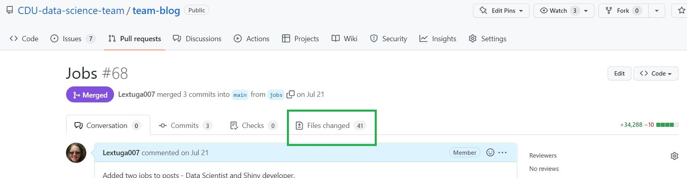
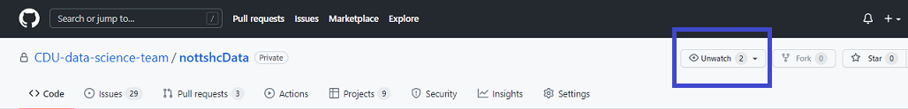
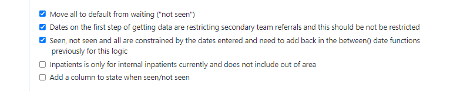
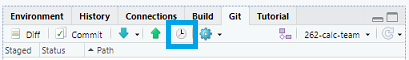
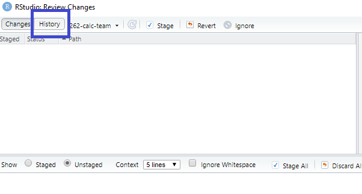
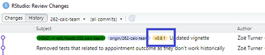
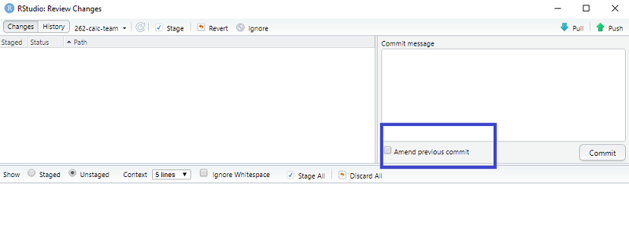

```{r setup, include=FALSE}
knitr::opts_chunk$set(echo = FALSE)
```

# Update

This post was edited in November 2022 with learnings that the team had since the post was originally written in 2021. Rather than writing a new post sections have been added with *Edit*.

Many other posts have been added with more technical detail and are tagged in the blog with <kbd>Github</kbd> and <kbd>Open source</kbd>.

# Team time

Our team has regular team times but which don't always focus on code. Quite often we use the opportunity to talk through processes and approaches to analysis and these notes reflect a recent code review where were discussed some of our learning on package development and workflow using GitHub for our (currently) private repository that takes data from the SQL data warehouses and makes it tidy following on from Milan Wiedemann's [nottshcverse](https://cdu-data-science-team.github.io/team-blog/posts/2021-08-06-nottshcverse/). 

These are some of the agreed points and discussions we had about some of the processes that have developed organically through working collaboratively. This process is very flexible and may change over time depending on our own developing skills or from others' input (we are always keen to know how to improve our workflows!) so this blog may be changed or superseded in the future.

Currently we are using a basic workflow of:

issue -> create a branch -> branch to development -> development to main -> package installed on people's machines and on the R Studio Connect server

*Edit*

Only one person should be responsible for the package and accepting pull requests. If several people can contribute it is now possible in GitHub to add specific branch protection rules (found in Settings in the repo) like requiring a pull request before merging. Always have a fresh look at the files changed in GitHub, even if you are working on the package alone. These can be found in the Pull request under Files changed:



# Start with an issue

Issues are not just for bugs and should also be used for features and questions. The benefits of issues are that they are highly searchable and can show thinking on subjects from something that may be a question becoming a feature. If people are following the repository they will be notified of any issues. You can also @ specific people in the issue itself which is good if you are the owner of the issue but want input from someone.



Issues often have one thing detailed but can have many parts to them in a task list:



The tasks can be ticked in the viewing mode without having to go to the code. To get the task list box type `- [ ]` and when it is ticked it becomes `- [X]`. Note that this is sensitive to spaces so any extra spaces will just show the code on the view mode.

We agreed in our team time that all issues, even questions, should be closed with a good summary of why it's closed. For example, we had an issue discussing whether it could be a feature to combine functions that were reliant on each other to save typing them out in analysis. This led to a discussion which resulted in no changes to the code (i.e. no branches) but the issue was closed with a detail on why no work was started on it. This is useful for knowledge sharing with other colleagues, and maybe even the future you, if the suggestion were ever to come up again

# Create a branch

From an issue a branch will need to be created and however you do this, either through R Studio or the terminal, ensure that the name starts with the number from the issue. The following is an image from the terminal in R Studio which shows all the branches in the project from the command `git branch`.

```
$ git branch
  101-test-colm-names
  101-test-column-names
  194-restrict-rio-demog
  232-calc-ips
  233-update-readme
  243-add-ulysses
* 262-calc-team
  change_calc_tot
  connections
  development
```

The active branch has a star next to it or appears in a different colour depending on the terminal and settings being used.

One of the downsides of not linking issues to branches is that any information on the work being done (difficulties or thoughts on the work) could be somewhere like a README but that is version controlled in code. Issues allow a form of version control but more in a sense of a conversation.

*Edit*

After working with GitHub for a while we've agreed to try to keep branches to a minimum as it can get very confusing having a lot of redundant branches. 

# Updating the branches

Some work/features take a long time to complete, and in the meantime the `development` and/or `main` branches could have changed. This can be a good thing but can also mean that you may be repeating some work that has already been done, for example, formatting some code so that it is within 80 characters which is what our team has agreed to do for code scripts. 

To update the local branch from another there are two git commands that can be used, either `fetch` or `pull`. 

`$ git pull origin main` does the `fetch` and merges. It only shows the changes if there is a conflict and is ok to use if you trust that the code works on the branch you are pulling from.

`$ git fetch origin main` will not necessarily look like it's done anything as the files will not be updated or changed, but it does update all the metadata on the changes. `fetch` is really good to use if you only want to take some of the changes, but not all.

Further information on how to use `git fetch` https://www.atlassian.com/git/tutorials/syncing/git-fetch.

# Development branch and different versions

When working collaboratively with someone on code it can be very easy to have a different version of the package so we've agreed to always build from the `main` branch. We do this directly from GitHub to ensure we are all building from the same code:

*Edit*

```
# Example code published on a README to help people load from main:
# install.packages("remotes")
remotes::install_github("CDU-data-science-team/nottshcPackage")
```

However, when working locally from `development` or from another branch we suggest using {devtools} and loading the package to the session using <kbd>Ctrl + Shift + l</kbd>.

If the workflow was to always `Build`, <kbd>Ctrl + Shift + b</kbd> or from GitHub:

```
# Example code published on a README to help people load from development:
# install.packages("remotes")
remotes::install_github("CDU-data-science-team/nottshcPackage@development")
```

it may cause issues with analysis as it will be the package all sessions use. It very easy to build from an experimental branch but then forget, do some analysis using the package and not realise that the package is different to `main`, which in turn is different to the team's version and the R Studio Connect version.

We discovered that, as it says above, `development` can move on rapidly from `main` so it's good to ensure versioning is carried from `development` to `main`. This helps identify what version people are working from. As an example, `main` may be v0.15.0 in its stable form but `development` is v.0.17.0. Ideally the move to `main` will be as rapid as possible but can be disruptive to analytical end users so needs to be done with everyone's knowledge. To do this we try to meet before any merge from `development` to `main` to go through the changes. This helps the end users of the package know what to expect and if anything has changed in the back end (like refactoring code) the end users are aware some changes have been made if things don't work as expected. 

Talking through changes is also a really good sense check and that all documentation has been done.

# Versioning packages

*Edit*

## Using {usethis} for version and NEWS.md

The {usethis} package can be used for updating documentation on the version in the `DESCRIPTION.R` file and the `NEWS.md` file. {usethis} can be used to set up a new `NEWS.md` file:

```
usethis::use_news_md()

```
and this is a great place to write about the package changes. These are now mostly about end user function additions or bugs, rather than internal changes like refactoring as the latter can cause confusion to users, particularly when the effects are minimal to their analysis. 

Versioning is best used on `development` and the types used are: [major, minor, patch and dev](https://usethis.r-lib.org/reference/use_version.html). For the most part the team's packages have had minor versions with a few patches.

## GitHub releases

Once on `main` it is good practice to use the [Releases in GitHub](https://docs.github.com/en/repositories/releasing-projects-on-github/managing-releases-in-a-repository) (on the right hand side of the main page) which often have the same information in them as the `NEWS.md` but is a good way to bundle up all the files together for any bug fixes. The team needed this once where a bug had been introduced into `main` but had been working on a previous version - however, a few versions back. Being able to reinstall the more stable, much older, version helped with analysis that was required urgently.

## Tagging commits in git

In team time we agreed that releases should only be on `main` and to keep a track on version in `development` we will instead use tags through Git.

We did a test tag in the Terminal: `git tag -a v0.9.1 -m "Testing (and there is a still a bug)"` and checked in R Studio, in the Commit History, to see if the tag was listed as this will be a good way to check people's versions of the package when working collaboratively.

Further information on tagging commits in git: https://www.atlassian.com/git/tutorials/inspecting-a-repository/git-tag

## Finding tagged commits

To check for tags, in R Studio, in the Git panel (top right as default) and the history icon of a clock. 



It's also possible to get to the same screen by selecting the Commit button and then the history tab.



In the commit history pane the tagged commit has a slightly different colour as well as being its own commit.



*Edit*

The team hasn't needed to use a Git tag yet but it's a good "bookmark" within the commit history to show when certain changes have been made.

# Words of caution with commits

#### Why you should write informative commits

As we were discussing how good messages in commits can help located older versions of code, we realised that the link to the issue or the branch is lost from the commits once merged to another branch. Consequently, commits like "Fixed" won't necessarily make sense when removed from the context like it being on a branch called `207-code10-error`. There is no reference in "Fixed" as to what was changed or what the error/problem was. It's therefore advisable to get into the habit of writing informative commits as if you were writing them to someone else even if, at the moment, you may be the only one working on the project.

#### When to commit

We had a divergence in the team about whether to commit chunks of working code or smaller steps. This was really down to personal preference but which were both based in differences in approaches to locating historic code changes. The 'lots of commits' approach can be a lot of text to go through to find when the code last 'worked'. However, many individual commits for particular actions can make it easier to pull out one commit that needs removing rather than re-work whole chunks. 

One thing we did all agree on was that the first commit is usually a large chunk of code and is often committed as `--First commit` or something similar. We also all had used the Amend previous commit in R Studio.



Ticking this button takes you to the last commit which can be changed and it also means that you can add new files or changed files to the commit that you may have missed. Changing the last commit doesn't work so well though if the commits have already been pushed as that will put the two last commits out of synch and that requires it's own blog in how to rectify! 

*Edit*

GitHub now offers several options for merges: `merge`, `rebase` or `squash` and so if your practice is to have many commits (also known as atomic commits) on a feature branch when this is merged to `development` you can use `squash` to reduce it to once commit. Just be careful of these options between `development` and `main` though as a `squash` to `main` will change the commit history and break the connection between the two branches. 