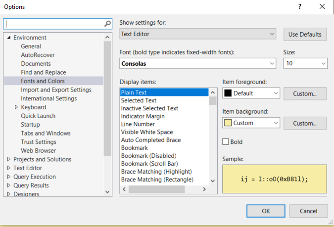
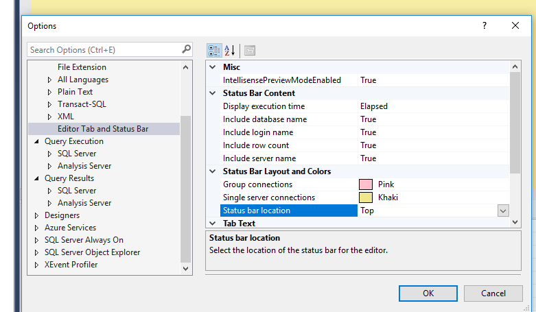
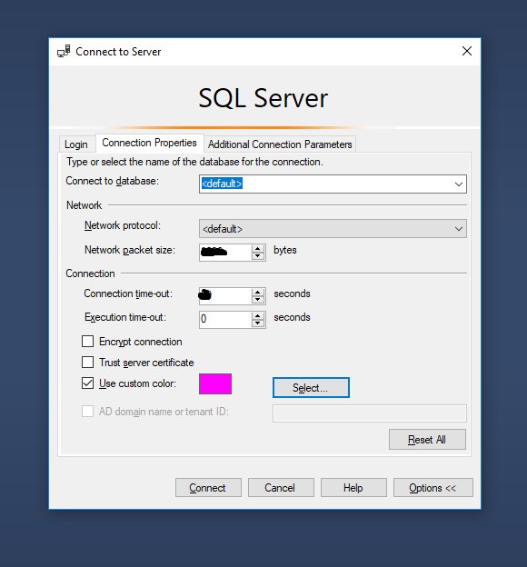
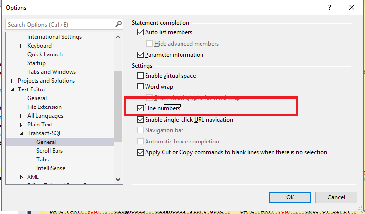

```{r setup, include=FALSE}
knitr::opts_chunk$set(echo = FALSE)
```

In my team I tend to still use a lot of SSMS for SQL coding. Having just got a new computer I quickly realised that the settings I'd made to make the layout a bit easier on my eyes had been lost but thankfully I'd noted some of the options which I'm going to share here for future me or anyone else interested in the settings in SSMS. In terms of IDE I, personally, find R Studio much better to set up for accessibility and appreciate their regular updates around this area. However, whilst I use R Studio (and specifically RMarkdown) for SQL workflows I don't always get the speed or error notifications like SSMS depending on the packages I use.

# Changing the back screen colour

This was a tip shared with me as a background that can help some people who are dyslexic. I'm not dyslexic but much prefer this colour as it offsets the glare of the default white background. There aren't set options in SSMS so you have to set the colour manually and the options can be found in <kbd>Tools/Options/Font and colors</kbd>.



The default yellow in the`Item background` is too bright for me so I change it in `Custom...` setting the following:

* Hue: 35
* Sat 205
* Lum 194 

The change will be implemented after the program is shut down and restarted.

# Changing position of the status bar

The status bar defaults to the bottom of the screen and says which server you are accessing, the database and it's also the information where how long a query took to run and how many rows are returned. I didn't like the position being at the bottom so I move this to the top in <kbd> Tools/Options/Text Editor/Editor Tab</kbd> changing the `Status bar location` to Top.


The change will be implemented after the program is shut down and restarted.

# Changing the colour of the status bar

This is really useful if you have access to other databases that share names and so can help with navigation. For example, I use a server, a dev(elopment) server and a staging server with similar names. It means that if I query the wrong one I'll get strange results. Changing the colour can help when I need the server and dev open at the same time and could get muddled.

This needs to be done when first connecting to the server when you select the <kbd>Connect to database</kbd>. After choosing the server you will want the colour bar to change for select the button called `Options >>` that follows `Connect`, `Cancel` and `Help`.

In the menu that appears you can tick <kbd>Use custom color:</kbd> and then `Select` to go to the colour's menu.



# Adding lines to the SQL script

When SQL gives errors it often refers to the line of code the error relates to. One trick is to double click on the red text in the query results and it will take you to the line (this doesn't always work well for CTEs Common Table Expressions and will just take you to the top line of the CTE). 

Line numbers on the script is not a default setting and have to be turned on, again in <kbd>Tools/Options/Text editor/Transact-SQL/General</kbd>:



The change will be implemented after the program is shut down and restarted.

# Query results include the header

Often when I copy out the results from SSMS I also need the column headers and this may not be default. Got to <kbd>Tools/Options/Query Results/SQL Server/Results to Grid</kbd> and select `Include column headers when copying or saving the results`.

# Any other tips?

There are probably plenty of other settings that are useful to know or sites that list these out and we are always keen to learn more so please do get in touch with creating an [issue](https://github.com/CDU-data-science-team/team-blog/issues) or [emailing the team](mailto:cduDataScience@nottshc.nhs.uk). 

# Hat Tip (and further resources)

The following was shared when this was [tweeted](https://twitter.com/DataScienceNott/status/1513833254251642882) by the [team account](https://twitter.com/DataScienceNott) and is a wonderful resource for many SQL techniques. The [presentation](https://github.com/BarneyLawrence/Sessions-TSQL-BeyondTheBasics/blob/master/T-SQL%20-%20Beyond%20the%20Basics.pptx) includes much of what is listed here because [Barney Lawrence](https://twitter.com/SQLBarney) had shared many of these with [Zoë Turner](https://twitter.com/Letxuga007) when he worked in Nottinghamshire Healthcare NHS Foundation Trust. It's wonderful that these techniques are being shared publicly through various media.