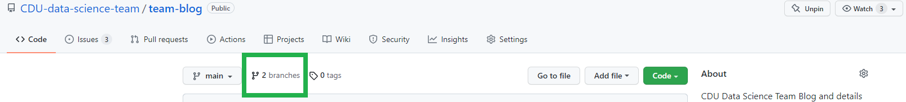

```{r setup, include=FALSE}
knitr::opts_chunk$set(echo = FALSE)
```

In the [GitHub SOP](https://cdu-data-science-team.github.io/team-blog/posts/2022-03-21-github-sop/#branches) we detailed how 

>Branches should be deleted as soon as possible

and this is good practice both locally and on GitHub. This short post details the ways to do this.

## Delete after a merge

Deleting on GitHub is very easy and doesn't require typing to the command line (although that is possible too). After merging a button will appear in purple saying `Delete branch` but it's also possible to set this as the default for the repository. In this case the purple button will say `Restore branch`.

Go to the `Settings` for the repository and then scroll down to the `Pull Requests` section. Select the `Automatically delete head branches`.

More information on this can be found on [GitHub help pages](https://docs.github.com/en/repositories/configuring-branches-and-merges-in-your-repository/configuring-pull-request-merges/managing-the-automatic-deletion-of-branches)

## Deleting stale branches in GitHub

Even if a pull request hasn't occurred it's possible to use GitHub to tidy the branches 



It's possible to delete branches, particularly "Stale" ones using the bin icon to the far right of the branch you want to delete.

## Restoring a deleted branch

Note that the branch will appear with a `Restore` button when first deleted but this disappears after the page is refreshed or some time has passed.

# Local branches

Once a branch is deleted remotely that doesn't automatically mean the local branches have gone. Even after a pull request to another branch (like main) so to tidy up locally it's advisable to use the <kbd>Terminal</kbd> if you want do to do this in RStudio and type:

`git branch -d <name-of-branch>`

## Removing stale connections

If a branch is deleted remotely it will still appear in the local git branches 


To remove these stale connections type in the <kbd>Terminal</kbd>

`git remote prune origin` 