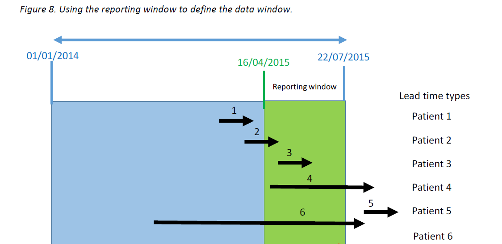

```{r setup, include=FALSE}
knitr::opts_chunk$set(echo = TRUE,
                      eval = FALSE)
```

Finding open referrals now is reasonably easy, it will be to look for where there is no date/time in discharges. However, if we need the open referrals last month, some of those referrals may be been closed since then.

A really nice graphic that illustrates the logic required to consider referrals (or other things) in a given period of time is this:



This is an image taken from the [AphA website](https://www.aphanalysts.org/wp-content/uploads/2016/08/JOIS_2016_038_Diagnosing_the_Flow_Constraint_i.pdf) but has since been moved sadly and details of the original authors lost. If you are the original owner or know who did this please do get in touch with an [issue](https://github.com/CDU-data-science-team/team-blog/issues) or [email](mailto:cduDataScience@nottshc.nhs.uk).

To explain the diagram:
`Patient one` had an open referral that was closed before the time we are counting.
`Patient two` had a open referral that closed in the time period.
`Patient three` had an open and closed referral within the time period.
`Patient four` started with a referral in the time period but ended afterwards.
`Patient five` started and ended after the time period.
`Patient six` started before and ended after the time period.

Open referrals to count are therefore include Patient 2, Patient 3, Patient 4 and Patient 6.
 
# Using SQL

There are three ways of doing this and because we use sk (synthetic or sythnesised keys) in our SQL tables for speed we join to a [specific date look up table](https://www.mssqltips.com/sqlservertip/4054/creating-a-date-dimension-or-calendar-table-in-sql-server/).

## WHERE clause

One line in the where clause (special thanks to [SQLBarney](https://twitter.com/SQLBarney) for this code):
 
```{sql }

declare @StartDate int = '20180401'
declare @EndDate int = '20190401'

--DischargeDate_sk = 0 won't be needed if the table doesn't use synthetic dates

SELECT Team, COUNT(DISTINCT patient) AS OpenReferrals
FROM SQLTable
WHERE ((DischargeDate_sk >= @StartDate OR DischargeDate_sk < = 0) AND ReferralDate_sk <= @EndDate)
GROUP BY Team

```

## Explicitly detail within the WHERE clause
 
Just to show exactly to replicate the patients included:

```{sql }

declare @StartDate int = '20180401'
declare @EndDate int = '20190401'

SELECT Team, COUNT(DISTINCT patient) AS OpenReferrals
FROM SQLTable
WHERE ((ReferralDate_sk < @StartDate AND (DischargeDate_sk > = @EndDate OR DischargeDate_sk = 0)) --Started before period and ended after period or still open (Patient 6)

OR (ReferralDate_sk < = @EndDate AND DischargeDate_sk > = @StartDate) --Started and ended in period (Patient 3) and (Patient 2)

OR (ReferralDate_sk > = @StartDate AND (DischargeDate_sk > = @EndDate OR r.DischargeDate_sk = 0)))--Started in period and ended after period or still open (Patient 4)
GROUP BY Team

```

## Creating a line for each day

This is particularly useful if you want to have individual days, for example, of open referrals that can then be aggregated up to other time units like months or years. It can produce very large datasets though depending on the time period being expanded. Counts of patients need to be on distinct ids as they will be repeated over time so:

Day 1 
Patient A
Patient B

Day 2
Patient B

Day 3
Patient C

If I want the count for the full three days the counts need to be 3 patients, but without a distinct 4 will be returned.

 
```{sql }

SELECT Team, COUNT(DISTINCT patient) AS OpenReferrals
FROM SQLTable
INNER JOIN DateTable AS dt1 ON ReferralDate_sk = dt1.date_sk ---Referral Date--
INNER JOIN DateTable AS dt2 ON DischargeDate_sk = dt2.date_sk ---Discharge Date--

--The sk dates need to be joined to the date tables to return a true date for the inner join

INNER JOIN DateTable AS d3 ON ReferralDate <= d3.date AND DischargeDate > = d3.date

WHERE d3.fin_year_name = '2018/19'
GROUP BY Team

```


## One day's referrals
 

Looking for 1 day's referrals can be a shorter line of code without the need for parameters:

```{sql }

SELECT Team, COUNT(DISTINCT patient) AS OpenReferrals
FROM SQLTable
INNER JOIN DateTable AS dt1 ON ReferralDate_sk = dt1.date_sk ---Referral Date--
INNER JOIN DateTable AS dt2 ON DischargeDate_sk = dt2.date_sk ---Discharge Date--

WHERE dt1.date <= '31 Mar 2019' AND (dt2.date > = '31 mar 2019' OR DischargeDate_sk = 0)

GROUP BY Team

```
 
# Using R

This can be recreated in R using dplyr but note that the functions used can be slow for many rows. It can be hard to filter the dates, particularly in Mental Health, as some referrals are open over many years and we need to include those patients 2 and 6 - who had an open referral start before the time period.

```{r}
caseload <- referrals %>%
  # Ensure dates are in date format, sometimes they get changed when imported 
  #from SQL, particularly date format (not so much datetime)
  
  # Using lubridate::today() where a discharge date is not entered (still open) 
  #makes this easier to work with dates in later code
  dplyr::mutate(
    referral_date = as.Date(referrals_referral_datetime),
    discharge_date = as.Date(referrals_discharge_datetime),
    discharge_date = case_when(is.na(discharge_date) ~ lubridate::today(),
                               TRUE ~ discharge_date)) %>%
  dplyr:: select(patient,
                 referral,
                 team,
                 referral_date,
                 discharge_date
  ) %>%
  dplyr::group_by(patient,
                  referral,
                  team) %>%
  # Pivot to tidy data (long)
  tidyr::pivot_longer(cols = ends_with("Date"),
                      names_to = "caseload",
                      values_to = "dates") %>% 
  dplyr::ungroup() # good practice to ungroup as can affect counts later

# complete() fills in the date sequence so 20200101 to 20200103 will now have a 
#line for dates 01, 02 and 03
fill_dates <- caseload %>%
  tidyr::complete(dates = seq.Date(min(dates), max(dates), by = "day")) 

# counting distinct patients
caseload_counts <- fill_dates %>%
  # although the dataset is now each day has a row, this is a count by month
  dplyr::mutate(month = lubridate::floor_date(dates, unit = "month")) %>% 
  dplyr::group_by(team,
                  month) %>%
  summarise(count_distinct_patients = n_distinct(client_id))

```

