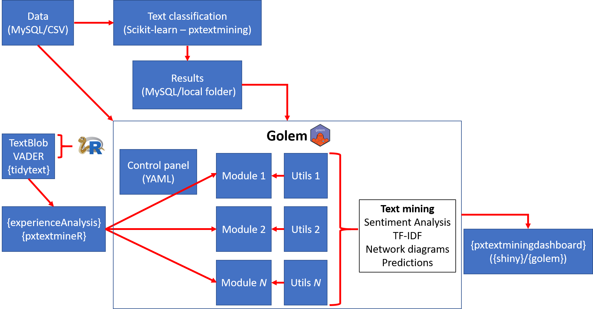

# A Text Mining Pipeline for NHS Patient Experience Feedback

This blog post is a more technical description of the pipeline that we have 
built to analyse patient feedback text data from the NHS. The pipeline consists
of two distinct modules:

- A [text classification pipeline](https://pypi.org/project/pxtextmining/) for 
  classifying patient feedback text into themes like Communication, 
  Environment/facilities, Staff, etc.
- A [text mining dashboard](https://github.com/CDU-data-science-team/pxtextminingdashboard) 
  reporting results from text classification, sentiment analysis, and analysis 
  of word frequencies to surface information about what patients most talk 
  about, what frustrates them, what they most like in the service etc.

For the scope and more high-level descriptions of the different analyses carried 
out see this [blog post](https://cdu-data-science-team.github.io/team-blog/posts/2020-12-14-classification-of-patient-feedback/) and [project description](https://github.com/CDU-data-science-team/pxtextminingdashboard#readme).

In terms of the nitty gritty, we are particularly excited about having combined
super-cool packages in R and Python to build the pipeline! Two highlights of our 
work are the use of what we consider to be game-changer R packages:

- [`{golem}`](https://thinkr-open.github.io/golem/index.html)- 
  "[…] an opinionated framework for building production-grade shiny 
  applications". Package `{golem}` automatically provides the structure for the
  `{shiny}` skeleton (app & ui) and makes it very easy to build Shiny apps that 
  are modular, strict as to where the business logic goes, documented, tested, 
  shareable, and agnostic to deployment.
- [`{reticulate}`](https://rstudio.github.io/reticulate/)- an R interface to 
  Python that opened up for us unique opportunities for using state-of-the-art 
  Python packages for text classification and sentiment analysis directly in R.
  
For more details, refer to [this presentation](https://www.youtube.com/watch?v=t7Iy0yHQXTg&list=PL4IzsxWztPdmHxCpS_c2l_jbMfrywWciZ&index=23)
where I describe both packages in much enthusiasm!

## Pipeline overview
Let's take a look at the whole pipeline:

The pipeline consists of an ecosystem of tailor-made packages in R ([`{experienceAnalysis}`](https://github.com/CDU-data-science-team/experienceAnalysis), 
[`{pxtextmineR}`](https://github.com/nhs-r-community/pxtextmineR), 
[`{pxtextminingdashboard}`](https://github.com/CDU-data-science-team/pxtextminingdashboard)) 
and Python ([`pxtextmining`]((https://pypi.org/project/pxtextmining/))) that
we designed to be both fit-for-purpose, but also as generic as possible for use
by other NHS trusts or by anyone in general. Let's break down the pipeline into
smaller steps:

1. The pipeline reads the text data and sends it to the text classification 
   pipeline, as well as to the dashboard.
1. The text classification pipeline uses [`Scikit-learn`](https://scikit-learn.org/stable/index.html)- fuelled 
   `pxtextmining` to tune and train a Machine Learning model. It then writes the
   results (predictions, performance metrics, classifier performance bar plots,
   a SAV with the trained text classification pipeline etc.). These are then 
   passed into dedicated modules in the `{golem}` dashboard  that present 
   predictions on unlabelled feedback, as well as tables and plots with 
   performance metrics.
1. Meanwhile, the text data is also passed into the dashboard for sentiment 
   analysis and other text mining (e.g. TF-IDFs). The dashboard has dedicated 
   modules that use our external packages to perform these analyses. In 
   particular, `{experienceAnalysis}` makes extensive use of `{tidytext}`, 
   although it offers functions that conveniently perform automatically a few 
   data preprocessing and manipulation steps that would otherwise need to be 
   done manually before passing them to the `{tidytext}` functions. On the other 
   hand, `{pxtextmineR}` has `{reticulate}`- fuelled functions for doing 
   sentiment analysis with Python packages `TextBlob` and `vaderSentiment`.
1. Internally, the `{golem}` dashboard also has a series of R scripts containing 
   simple utility functions that are useful for running small tasks (e.g. 
   sort a character vector) that would otherwise be run inside the modules 
   themselves.
1. Note that using external packages and utility functions to prepare the data 
   keeps the modules clean from any business logic that would make the dashboard 
   too specific to the dataset used. This is a key advantage of `{golem}`: we 
   can use the dashboard as a framework for reporting results on _any_ dataset 
   that we would like to use! A simple example is the following: say we want to 
   report averages for a number of categories. This could be mean sepal length 
   for each plant species in the `iris` data, mean flipper length for each 
   penguin species in the `penguin` data, and mean miles per gallon for each 
   car engine type in the `mtcars` data. We can build a `{golem}` that produces 
   the mean of a variable according to different categories and then pass either 
   `iris`, `penguin` or `mtcars` to get a dashboard for each of these datasets.
1. And this is exactly where the YAML file in `{golem}` comes in handy. The YAML 
   file acts as a control panel where the user specifies what dataset and which 
   columns from the dataset to use in the business logic. In our case, this 
   means that we can produce a dashboard for our own data or for the patient 
   feedback data of _any_ NHS trust! As deployment with `{golem}` is pretty 
   straightforward, we are able to host several dashboards on the server, each 
   of which uses a dataset from a different NHS trust.
1. Amazingly, `{golem}` ships the whole dashboard as an R package! We call our 
   packaged dashboard `pxtextminingdashboard`. This package contains open 
   patient experience data in RDA format that can be used to run the app. All 
   you need to do is install `pxtextminingdashboard`, load it in R and run 
   `run_app`. The dashboard is also available [here](https://involve.nottshc.nhs.uk/rsconnect/pxtextminingdashboard/). 

# Conclusion
We have built a truly revolutionary text mining pipeline that can be used for 
free by any NHS trust and will hopefully help surface business-critical 
information to guide improvements in healthcare services. We believe that the 
pipeline is a great example of how one can make the best of both R and 
Python. Both `{golem}` and `{reticulate}` are game-changers- try them out!
